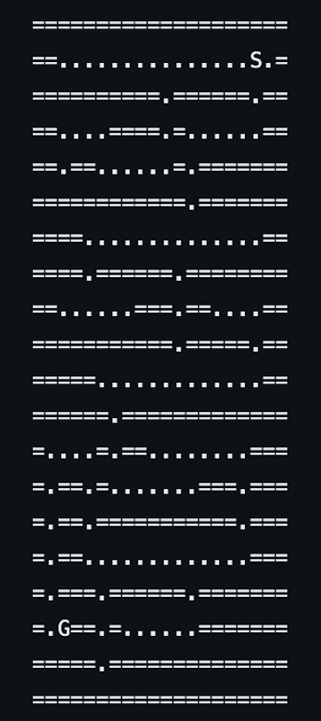
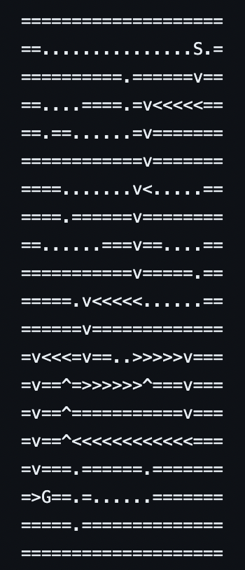

<!-- Improved compatibility of back to top link: See: https://github.com/othneildrew/Best-README-Template/pull/73 -->

<a name="readme-top"></a>

<!--
*** Thanks for checking out the Best-README-Template. If you have a suggestion
*** that would make this better, please fork the repo and create a pull request
*** or simply open an issue with the tag "enhancement".
*** Don't forget to give the project a star!
*** Thanks again! Now go create something AMAZING! :D
-->

<!-- PROJECT SHIELDS -->
<!--
*** I'm using markdown "reference style" links for readability.
*** Reference links are enclosed in brackets [ ] instead of parentheses ( ).
*** See the bottom of this document for the declaration of the reference variables
*** for contributors-url, forks-url, etc. This is an optional, concise syntax you may use.
*** https://www.markdownguide.org/basic-syntax/#reference-style-links
-->

[![Contributors][contributors-shield]][contributors-url]
[![Forks][forks-shield]][forks-url]
[![Stargazers][stars-shield]][stars-url]
[![Issues][issues-shield]][issues-url] [![MIT License][license-shield]][license-url] [![LinkedIn][linkedin-shield]][linkedin-url] <!-- PROJECT LOGO --> <br /> <div align="center"> <a href="https://github.com/LukeMacdonald/path-finder-cpp">  </a> <h3 align="center">C++ Maze Solver</h3> <p align="center"> <br />
<a href="https://github.com/LukeMacdonald/path-finder-cpp"><strong>Explore the docs »</strong></a>
<br />
<br />

  </p>
</div>

<!-- TABLE OF CONTENTS -->
<details>
  <summary>Table of Contents</summary>
  <ol>
    <li>
      <a href="#about-the-project">About The Project</a>
      <ul>
        <li><a href="#built-with">Built With</a></li>
      </ul>
    </li>
    <li>
      <a href="#getting-started">Getting Started</a>
      <ul>
        <li><a href="#prerequisites">Prerequisites</a></li>
        <li><a href="#installation">Installation</a></li>
      </ul>
    </li>
    <li><a href="#contact">Contact</a></li>
  </ol>
</details>

<!-- ABOUT THE PROJECT -->

## About The Project

<div align="center"  class="row">


</div>

The Maze Solver project aims to develop a C++ application that can take a maze as input and output a path through the maze.
The program employs algorithms to navigate through the maze and find the optimal or feasible path from the start point to the end point.

<p align="right">(<a href="#readme-top">back to top</a>)</p>

### Built With

<div style="column-count: 2; -webkit-column-count: 2 -moz-column-count: 2;">

- [![C++][C++-badge]][C++-url]

</div>

<p align="right">(<a href="#readme-top">back to top</a>)</p>

<!-- GETTING STARTED -->

## Getting Started

This is an example of how you may give instructions on setting up your project locally.
To get a local copy up and running follow these simple example steps.

### Prerequisites

- [C++ Compiler](https://code.visualstudio.com/docs/languages/cpp)

### Installation

1. Clone the repo
   ```sh
   git clone https://github.com/LukeMacdonald/path-finder-cpp.git
   ```
2. Compile project

   ```sh
   g++ -Wall -Werror -std=c++14 -g -O -o solver Node.cpp NodeList.cpp PathPlanner.cpp main.cpp
   ```

3. Add maze file into root directory. Maze text file should take on similar structure to below

   ```sh
   ====================
   ==...............S.=
   ==========.======.==
   ==....====.=......==
   ==.==......=.=======
   ============.=======
   ====..............==
   ====.======.========
   ==......===.==....==
   ===========.=====.==
   =====.............==
   ======.=============
   =....=.==........===
   =.==.=.......===.===
   =.==.===========.===
   =.==.............===
   =.===.======.=======
   =.G==.=......=======
   =====.==============
   ====================
   ```

   - `=` -- Walls
   - `S` -- Starting position
   - `G` -- Goal position
   - `.` -- Available position to traverse

4. Run program
   ```sh
   ./solver <INPUT_FILE >OUTPUT_FILE
   ```

<p align="right">(<a href="#readme-top">back to top</a>)</p>

## Contact

Luke Macdonald - lukemacdonald21@gmail.com.com

Project Link: [https://github.com/LukeMacdonald/path-finder-cpp](https://github.com/LukeMacdonald/path-finder-cpp)

<p align="right">(<a href="#readme-top">back to top</a>)</p>

<!-- MARKDOWN LINKS & IMAGES -->
<!-- https://www.markdownguide.org/basic-syntax/#reference-style-links -->

[contributors-shield]: https://img.shields.io/github/contributors/LukeMacdonald/path-finder-cpp.svg?style=for-the-badge
[contributors-url]: https://github.com/LukeMacdonald/path-finder-cpp/graphs/contributors
[forks-shield]: https://img.shields.io/github/forks/LukeMacdonald/path-finder-cpp.svg?style=for-the-badge
[forks-url]: https://github.com/LukeMacdonald/path-finder-cpp/network/members
[stars-shield]: https://img.shields.io/github/stars/LukeMacdonald/path-finder-cpp.svg?style=for-the-badge
[stars-url]: https://github.com/LukeMacdonald/path-finder-cpp/stargazers
[issues-shield]: https://img.shields.io/github/issues/LukeMacdonald/path-finder-cpp.svg?style=for-the-badge
[issues-url]: https://github.com/LukeMacdonald/path-finder-cpp/issues
[license-shield]: https://img.shields.io/github/license/LukeMacdonald/path-finder-cpp.svg?style=for-the-badge
[license-url]: https://github.com/LukeMacdonald/path-finder-cpp/blob/master/LICENSE.txt
[linkedin-shield]: https://img.shields.io/badge/-LinkedIn-black.svg?style=for-the-badge&logo=linkedin&colorB=555
[linkedin-url]: https://linkedin.com/in/luke-macdonald-292a4a208
[product-screenshot]: images/screenshot.png
[C++-badge]: https://img.shields.io/badge/c++-%2300599C.svg?style=for-the-badge&logo=c%2B%2B&logoColor=white
[C++-url]: https://cplusplus.com/doc/tutorial/
